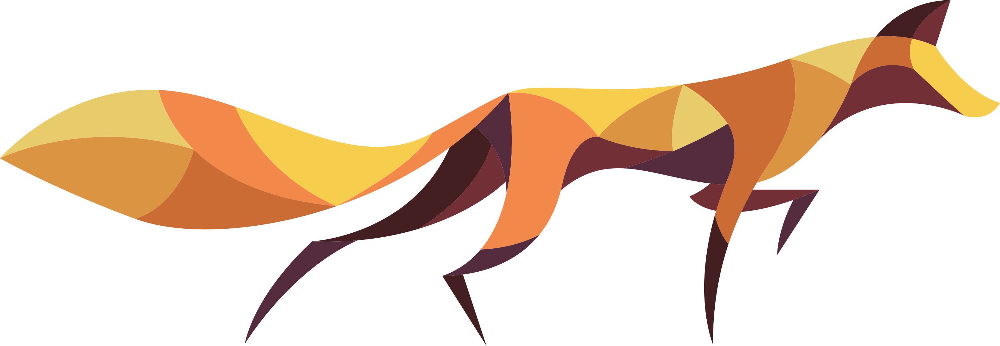

  

# Foxws

Building with the Laravel ecosystem — PHP, Inertia.js, Livewire, and modern JS/TypeScript.

Check out [foxws.nl](https://foxws.nl) for documentation on some of my packages. Every package also ships its own docs, right in its `docs/` folder.

## What I work with

- **Laravel** — including custom packages
- **PHP**
- **JavaScript / TypeScript**
- **Inertia.js** and **Livewire**

## How I work

I use AI to speed up development and move faster, but I always have the final say — I review, approve, and adjust every implementation before it ships.
